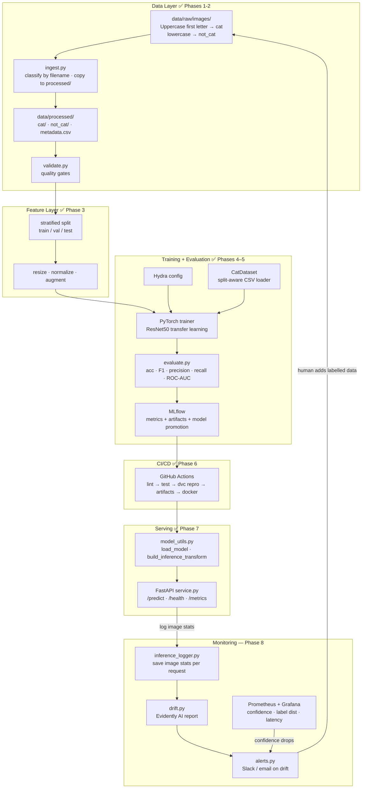
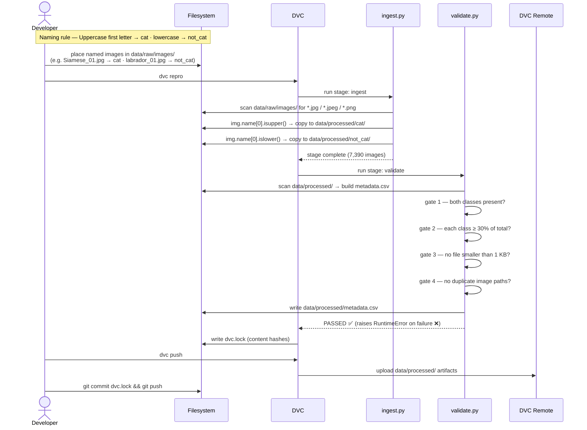
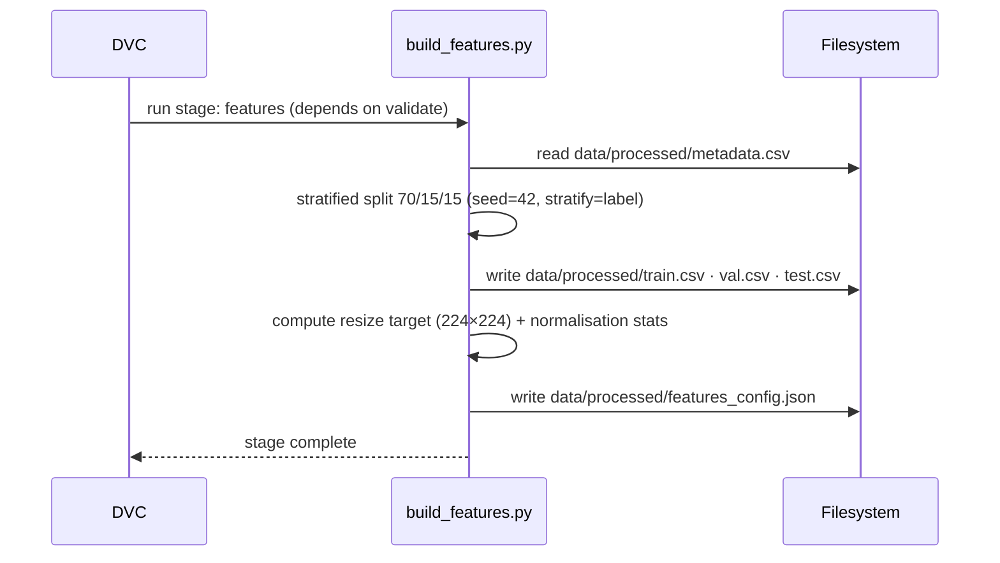
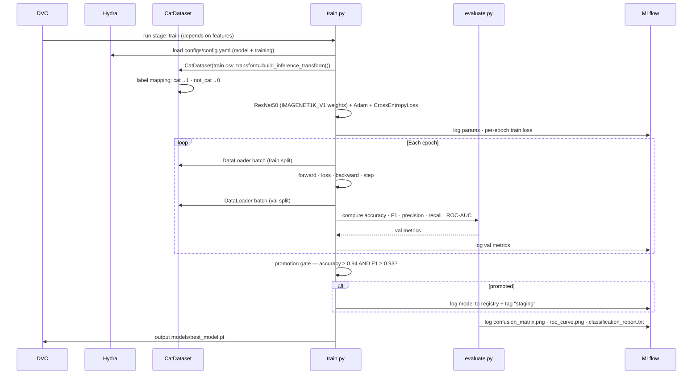
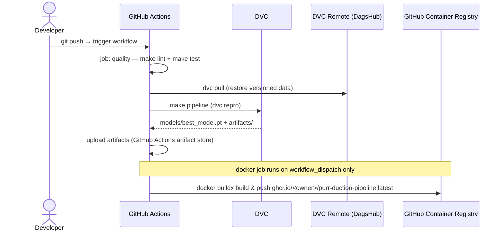
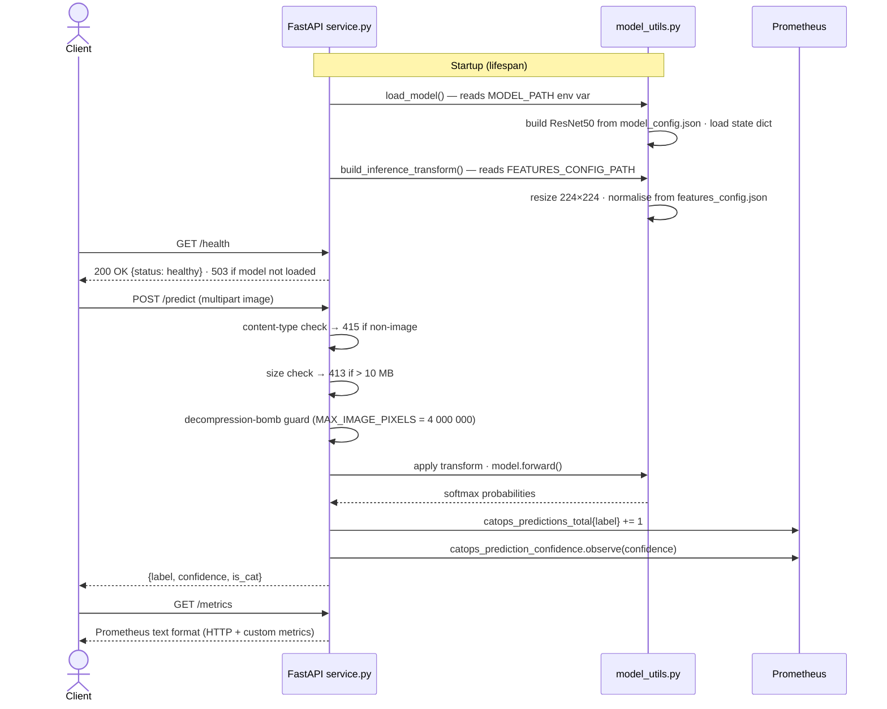
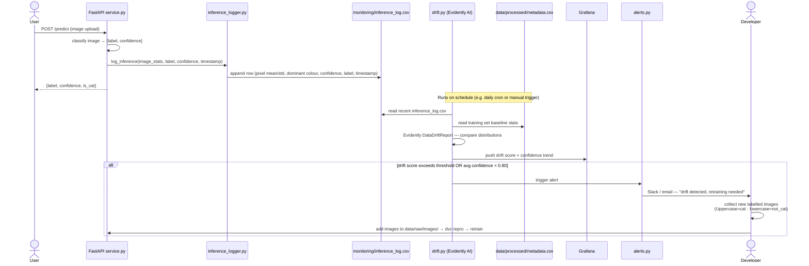

# Architecture Documentation – "Am I a Cat?"

**Binary Image Classification MLOps System**  
*Cat vs. Not-Cat* – Production-Ready, Fully Automated, Reproducible Pipeline

**Version**: 1.5  
**Last Updated**: 2026-05-10  
**Status**: Phase 7 of 8 complete — FastAPI serving layer live · Phase 8 designed

## 1. Project Overview

The “Am I a Cat?” system is a **binary image classifier** that determines whether an input image contains a cat or not.  
What starts as a simple notebook model will be transformed into a **complete MLOps platform** with:
- Automated, versioned data pipelines
- Reproducible experiments with full lineage
- Continuous training & model promotion
- Production-grade serving with monitoring & drift detection
- Zero-downtime CI/CD deployments

**Key Objectives**
- 100% reproducibility (code + data + config + environment)
- Automated quality gates at every stage
- Model governance & promotion rules
- Scalable serving (batch + real-time)
- Observability & alerting for data/model drift

## 2. Phase Roadmap

| Phase | Description                                      | Status    |
|-------|--------------------------------------------------|-----------|
| 1     | Project scaffold (Poetry + DVC + Git)            | ✅ Done   |
| 2     | Data ingestion + validation                      | ✅ Done   |
| 3     | Feature engineering + stratified train/val/test split | ✅ Done   |
| 4     | Model training (PyTorch + Hydra + MLflow)        | ✅ Done   |
| 5     | Experiment tracking (MLflow full integration)    | ✅ Done   |
| 6     | CI/CD pipeline (GitHub Actions)                  | ✅ Done   |
| 7     | Model serving (FastAPI + Prometheus)             | ✅ Done   |
| 8     | Monitoring + drift detection                     | Planned   |

---

## 3. High-Level Architecture



---

## 4. Sequence Diagrams

### 4.1 Data Pipeline (Phases 1–2)



### 4.2 Feature Engineering (Phase 3)



### 4.3 Training & Evaluation (Phases 4–5)



### 4.4 CI/CD (Phase 6)



### 4.5 Inference / Serving (Phase 7)



### 4.6 Monitoring & Drift Detection (Phase 8)



---

## 5. Detailed Component Architecture

### 5.1 Data Layer (✅ implemented)

**ingest.py** (`src/catops/data/ingest.py`)

| Responsibility | Detail |
|----------------|--------|
| Source dataset | Oxford-IIIT Pet (37 breeds, JPEG); any user-added images following the same convention |
| Classification rule | `filename[0].isupper()` → `cat`; `filename[0].islower()` → `not_cat` |
| Input | `data/raw/images/` — flat directory; optionally bootstrapped from `images.tar.gz` |
| Output | `data/processed/cat/` and `data/processed/not_cat/` |
| Idempotent | Skips tar extraction if `data/raw/images/` already exists |
| Adding new data | Place new files in `data/raw/images/` with correct capitalisation (see `docs/HowToAddData.md`) |

**validate.py** (`src/catops/data/validate.py`)

| Quality Gate | Rule |
|--------------|------|
| Class existence | Both `cat` and `not_cat` must be present with > 0 images |
| Class balance | Each class must be ≥ 30% of total |
| File integrity | No files smaller than 1 KB |
| Deduplication | No duplicate `image_path` values |
| Output | `data/processed/metadata.csv` (columns: image_path, label, file_size) |

**DVC pipeline** (`dvc.yaml`)
```
ingest  ──►  validate
  │               │
  └─► data/processed/   (shared, DVC-tracked)
```
Both stages are cached — `dvc repro` is a no-op if inputs are unchanged.

### 5.1.3 Features Stage (Phase 3 – ✅ Done)

**build_features.py** (`src/catops/features/build_features.py`)

| Responsibility                  | Detail |
|---------------------------------|--------|
| Stratified split                | 70/15/15 using `label` column + fixed seed=42 |
| Outputs                         | `train.csv`, `val.csv`, `test.csv` (paths + labels only) |
| Preprocessing decisions         | Resize target (224×224) + normalization stats (saved as `features_config.json`) |
| Validation                      | Extended gates in `validate.py` (class balance preserved, no leakage) |
| DVC stage                       | `features` (cached, depends on `validate`) |

All artifacts are now part of the official **data contract** consumed by training.

### 5.2 Training Layer (Phases 4–5 — ✅ implemented)

**dataset.py** (`src/catops/data/dataset.py`)

| Responsibility | Detail |
|---|---|
| Purpose | Split-aware image loader — replaces `ImageFolder` over raw dirs |
| Input | Any of `train.csv`, `val.csv`, `test.csv` (columns: `image_path`, `label`) |
| Label mapping | `cat → 1`, `not_cat → 0` |
| Transforms | Injected at construction (resize + normalize from `features_config.json`) |

**train.py** (`src/catops/training/train.py`)

| Responsibility | Detail |
|---|---|
| Model | ResNet50 — modern `ResNet50_Weights.IMAGENET1K_V1` API (no deprecation warnings) |
| Dataset | `CatDataset(train.csv)` — respects stratified split, no data leakage |
| Device | MPS (Apple Silicon) if available, else CPU |
| Optimizer | Adam, lr from `cfg.training.learning_rate` |
| Loss | CrossEntropyLoss |
| Config | Hydra (`configs/config.yaml` → `model.yaml` + `training.yaml`) |
| Reproducibility | `torch.manual_seed` fixed via `cfg.training.seed` |
| Tracking | MLflow experiment `am-i-a-cat`: params, per-epoch train loss, val metrics, artifacts |
| Promotion | Real val metrics gated: accuracy ≥ 0.94 **and** F1 ≥ 0.93 → logged to MLflow registry + tagged `staging` |
| DVC output | `models/best_model.pt` (state dict) |

**evaluate.py** (`src/catops/evaluation/evaluate.py`)

| Metric / Artifact | Detail |
|---|---|
| Accuracy | `sklearn.metrics.accuracy_score` on val (or test) split |
| F1 | Weighted F1 score |
| Precision / Recall | Weighted, per-class breakdown |
| ROC-AUC | Binary, on softmax probabilities |
| Confusion matrix | Seaborn heatmap — logged as `artifacts/confusion_matrix.png` |
| ROC curve | Matplotlib — logged as `artifacts/roc_curve.png` |
| Classification report | Text artifact — logged as `artifacts/classification_report.txt` |

**Configs** (`configs/`)

| File | Key settings |
|---|---|
| `model.yaml` | `name: resnet50`, `pretrained: true`, `num_classes: 2`, `dropout: 0.2` |
| `training.yaml` | `epochs: 10`, `batch_size: 32`, `lr: 0.001`, `seed: 42` |
| `training.yaml` (promotion) | `min_accuracy: 0.94`, `min_f1: 0.93`, `min_precision: 0.90` |

**DVC train stage dependencies (updated)**
```
features → train (depends on: train.py, evaluate.py, dataset.py, feature CSVs, configs)
           outs:  models/best_model.pt, artifacts/
```

### 5.4 Serving Layer (Phase 7 — ✅ implemented)

**model_utils.py** (`src/catops/serving/model_utils.py`)

| Responsibility | Detail |
|---|---|
| `load_model()` | Builds ResNet50 architecture from `model_config.json`, loads state dict with `weights_only=True`; path overridable via `MODEL_PATH` env var |
| `build_inference_transform()` | Reads resize target + normalization stats from `features_config.json` at runtime; path overridable via `FEATURES_CONFIG_PATH` env var |
| Class mapping | `CLASS_NAMES = {0: "cat", 1: "not_cat"}` — matches `CatDataset` encoding |

**service.py** (`src/catops/serving/service.py`)

| Endpoint | Method | Description |
|---|---|---|
| `/health` | GET | Returns 200 if model is loaded, 503 otherwise |
| `/predict` | POST (multipart) | Accepts image upload, returns `{label, confidence, is_cat}` |
| `/metrics` | GET | Prometheus text format — HTTP instrumentation + custom metrics |

| Security / robustness feature | Detail |
|---|---|
| File size limit | 10 MB max; reads MAX+1 bytes to detect without loading full file |
| Decompression bomb guard | `Image.MAX_IMAGE_PIXELS = 4_000_000` (~2000×2000) |
| Content-type pre-validation | 415 for non-image MIME types before any decode attempt |
| Device handling | Input tensor moved to model device with `.to(device)` |

| Prometheus metric | Type | Labels |
|---|---|---|
| `catops_predictions_total` | Counter | `label` (cat / not_cat) |
| `catops_prediction_confidence` | Histogram | — (buckets 0.5–1.0) |
| HTTP request metrics | Counter + Histogram | auto-instrumented via `prometheus-fastapi-instrumentator` |

**Docker**

| Setting | Value |
|---|---|
| Base image | `python:3.12-slim` |
| User | `appuser` (uid 1001) — non-root |
| Port | 3000 |
| CMD | `uvicorn src.catops.serving.service:app --host 0.0.0.0 --port 3000 --workers 2 --access-log` |

### 5.5 CI/CD (Phase 6 — ✅ implemented)

**Workflow** (`.github/workflows/ci-cd.yml`) — triggers on every push/PR to `main` and `workflow_dispatch`:

| Job | Steps | Condition |
|-----|-------|-----------|
| `quality` | Install deps → `make lint` → `make test` | always |
| `pipeline` | Install deps → configure DVC remote (DagsHub) → `dvc pull` → `make pipeline` → upload `models/best_model.pt` + `artifacts/` | after `quality` |
| `docker` | Docker Buildx → GHCR login → build & push `ghcr.io/<owner>/purr-duction-pipeline:latest` | `workflow_dispatch` on `main` only |

**Secrets required**: `DAGSHUB_USER`, `DAGSHUB_TOKEN` (DVC remote auth).

### 5.6 Monitoring & Drift Detection (Phase 8 — planned)

**The core problem**: once the model is deployed, the images people send to `/predict` may gradually look different from the training data. The model silently degrades — confidence drops, misclassifications increase — with no visible signal unless you instrument it.

**Solution**: log a statistical fingerprint of every inference request, periodically compare it against the training baseline, and alert when the distributions diverge.

---

**inference_logger.py** (`src/catops/monitoring/inference_logger.py`)

Called inside `/predict` after every successful classification — adds one row to the inference log without blocking the response.

| Field logged | Detail |
|---|---|
| `timestamp` | ISO-8601 request time |
| `pixel_mean_r/g/b` | Per-channel mean pixel value of the uploaded image |
| `pixel_std_r/g/b` | Per-channel standard deviation |
| `predicted_label` | `cat` or `not_cat` |
| `confidence` | Softmax score for the predicted class |

Output: `monitoring/inference_log.csv` — append-only, one row per request.

---

**drift.py** (`src/catops/monitoring/drift.py`)

Runs on a schedule (daily cron or `make drift-report`). Compares the recent inference log against the training set baseline using Evidently AI.

| Step | Detail |
|---|---|
| Load baseline | Compute pixel stats from `data/processed/metadata.csv` (training images) |
| Load current window | Read last N rows from `monitoring/inference_log.csv` |
| Evidently `DataDriftReport` | Column-level drift test on pixel mean/std channels |
| Output | `monitoring/drift_report.html` — human-readable report |
| Drift score | Extracted from the report; compared against a configurable threshold |

---

**alerts.py** (`src/catops/monitoring/alerts.py`)

Fires when `drift.py` detects drift or when average confidence in the inference window drops below the threshold.

| Condition | Trigger |
|---|---|
| Evidently drift score > threshold | Distribution of incoming images differs from training |
| Rolling average confidence < 0.80 | Model is uncertain — likely out-of-distribution inputs |

Alert payload: drift score, confidence trend, link to `drift_report.html`, instructions to retrain.

---

**Grafana dashboard** (`docker-compose.yml` + `monitoring/grafana/`)

| Panel | Source metric |
|---|---|
| Prediction label distribution over time | `catops_predictions_total` (Prometheus) |
| Confidence histogram | `catops_prediction_confidence` (Prometheus) |
| Request rate | `http_requests_total` (Prometheus) |
| Drift score trend | Pushed by `drift.py` as a Prometheus gauge |

---

**Retraining loop**

The monitoring system cannot label production images automatically — uploaded images have no ground-truth label. The loop is human-assisted:

```
Alert fires
    → Developer reviews drift_report.html
    → Collects new labelled images (Uppercase filename = cat, lowercase = not_cat)
    → Drops them into data/raw/images/
    → Runs: poetry run dvc repro --force && poetry run dvc push
    → New model trained, evaluated, and promoted if it passes the promotion gate
```

## 6. Technology Stack

| Layer               | Tool                          | Status   | Reason |
|---------------------|-------------------------------|----------|--------|
| Dependency mgmt     | Poetry                        | ✅ Active | Reproducible lockfile |
| Data versioning     | DVC + local / S3 / GCS remote | ✅ Active | Git-like semantics for large files |
| Code quality        | Ruff + Black + Mypy           | ✅ Active | Lint, format, type-check |
| Pre-commit hooks    | pre-commit + DVC hooks        | ✅ Active | Enforce DVC sync on commit/push |
| Data processing     | Pillow + pandas + tqdm        | ✅ Active | Image handling and metadata |
| Config management   | Hydra + OmegaConf             | ✅ Active | Multi-run, sweepable configs |
| Training            | PyTorch 2 + TorchVision       | ✅ Active | ResNet50 transfer learning, split-aware CatDataset |
| Evaluation          | scikit-learn + matplotlib + seaborn | ✅ Active | Full classification metrics + confusion matrix + ROC curve |
| Experiment tracking | MLflow                        | ✅ Active | Run tracking, artifact logging, model promotion |
| Serving             | FastAPI + Prometheus          | ✅ Active | Async inference, Prometheus metrics, non-root Docker |
| Containerisation    | Docker                        | ✅ Active | Non-root user, uvicorn multi-worker CMD |
| CI/CD               | GitHub Actions                | ✅ Active | quality → pipeline → docker jobs; DagsHub DVC remote |
| Monitoring          | Evidently AI + Prometheus + Grafana | Planned | Inference logging · drift reports · confidence dashboards · alerts |
| Cloud (optional)    | AWS / GCP (S3 + GPU runners)  | Planned  | Scalability |

---

## 7. Repository Layout

```
purr-duction-pipeline/
├── src/
│   └── catops/
│       ├── __init__.py
│       ├── data/
│       │   ├── ingest.py          # Phase 2: classify by filename capitalisation + copy to processed/
│       │   ├── validate.py        # Phase 2: quality gates + metadata.csv
│       │   └── dataset.py         # Phase 3: CatDataset, split-aware CSV loader
│       ├── features/
│       │   └── build_features.py  # Phase 3: stratified split + features_config.json
│       ├── training/
│       │   └── train.py           # Phases 4–5: ResNet50 + MLflow tracking + promotion gate
│       ├── evaluation/
│       │   └── evaluate.py        # Phase 5: accuracy · F1 · confusion matrix · ROC curve
│       ├── serving/               # Phase 7: FastAPI service
│       │   ├── model_utils.py     # load_model() + build_inference_transform()
│       │   └── service.py         # /predict · /health · /metrics
│       ├── monitoring/            # Phase 8: drift detection
│       │   ├── inference_logger.py  # log pixel stats + confidence per request
│       │   ├── drift.py             # Evidently AI drift report
│       │   └── alerts.py            # Slack / email notifications
│       └── utils/                 # shared logging, config helpers
├── configs/                       # Hydra configs: config.yaml → model.yaml + training.yaml
├── pipelines/                     # DVC stage helpers + future orchestration flows
├── data/
│   ├── raw/
│   │   └── images/                # flat directory — filenames determine class (Uppercase=cat)
│   └── processed/
│       ├── cat/                   # owned by ingest.py
│       ├── not_cat/               # owned by ingest.py
│       ├── metadata.csv           # owned by validate.py
│       ├── train.csv              # owned by build_features.py
│       ├── val.csv                # owned by build_features.py
│       ├── test.csv               # owned by build_features.py
│       └── features_config.json   # resize target + normalisation stats
├── models/
│   └── best_model.pt              # DVC output of train stage
├── artifacts/                     # confusion_matrix.png · roc_curve.png · classification_report.txt
├── monitoring/                    # Phase 8 runtime outputs
│   ├── inference_log.csv          # append-only log (one row per /predict call)
│   └── drift_report.html          # Evidently AI report (generated on demand)
├── docker/                        # Dockerfile (non-root, uvicorn multi-worker)
├── .github/workflows/             # ci-cd.yml: quality → pipeline → docker
├── tests/                         # unit + integration + data validation tests
├── notebooks/                     # exploration only (never committed with outputs)
├── docs/
│   ├── Architecture.md
│   ├── HowToAddData.md
│   └── ProjectScope.md
├── dvc.yaml                       # pipeline stage definitions
├── dvc.lock                       # content hashes (commit this, not the data)
├── params.yaml                    # experiment parameters
├── pyproject.toml                 # Poetry: deps + tool config
├── Makefile                       # developer commands (install · test · lint · pipeline · serve)
├── .pre-commit-config.yaml
└── README.md
```

**Planned additions (Phase 8)**

```
├── docker-compose.yml             # local Prometheus + Grafana stack
└── monitoring/
    └── grafana/
        └── dashboard.json         # pre-built Grafana dashboard (confidence · label dist · drift score)
```