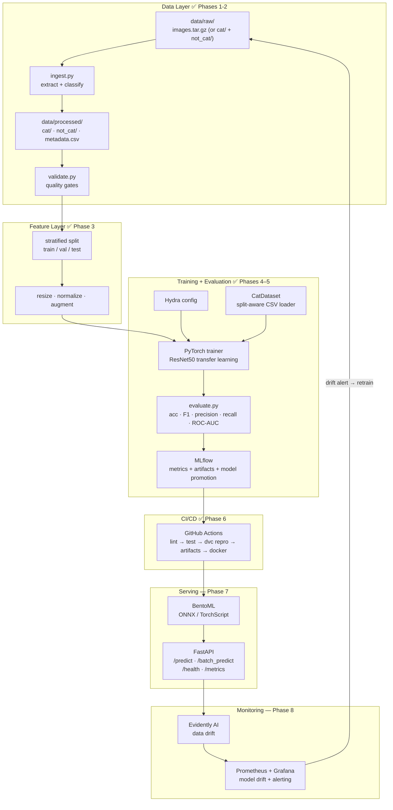
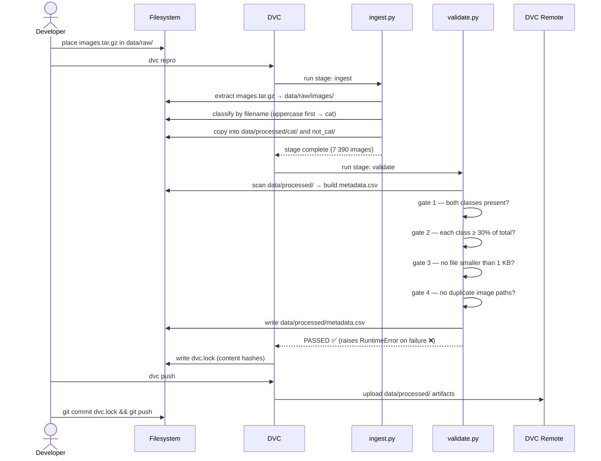

# Architecture Documentation – "Am I a Cat?"

**Binary Image Classification MLOps System**  
*Cat vs. Not-Cat* – Production-Ready, Fully Automated, Reproducible Pipeline

**Version**: 1.2  
**Last Updated**: 2026-05-09  
**Status**: Phase 6 of 8 complete — CI/CD pipeline live on GitHub Actions

## 1. Project Overview

The “Am I a Cat?” system is a **binary image classifier** that determines whether an input image contains a cat or not.  
What starts as a simple notebook model will be transformed into a **complete MLOps platform** with:
- Automated, versioned data pipelines
- Reproducible experiments with full lineage
- Continuous training & model promotion
- Production-grade serving with monitoring & drift detection
- Zero-downtime CI/CD deployments

**Key Objectives**
- 100% reproducibility (code + data + config + environment)
- Automated quality gates at every stage
- Model governance & promotion rules
- Scalable serving (batch + real-time)
- Observability & alerting for data/model drift

## 2. Phase Roadmap

| Phase | Description                                      | Status    |
|-------|--------------------------------------------------|-----------|
| 1     | Project scaffold (Poetry + DVC + Git)            | ✅ Done   |
| 2     | Data ingestion + validation                      | ✅ Done   |
| 3     | Feature engineering + stratified train/val/test split | ✅ Done   |
| 4     | Model training (PyTorch + Hydra + MLflow)        | ✅ Done   |
| 5     | Experiment tracking (MLflow full integration)    | ✅ Done   |
| 6     | CI/CD pipeline (GitHub Actions)                  | ✅ Done   |
| 7     | Model serving (BentoML + FastAPI)                | Planned   |
| 8     | Monitoring + drift detection                     | Planned   |

---

## 3. High-Level Architecture



---

## 4. Sequence Diagram — Data Pipeline (Phases 1-2)



---

## 5. Detailed Component Architecture

### 5.1 Data Layer (✅ implemented)

**ingest.py** (`src/catops/data/ingest.py`)

| Responsibility | Detail |
|----------------|--------|
| Source dataset | Oxford-IIIT Pet (37 breeds, JPEG) |
| Classification rule | Uppercase first letter → `cat`; lowercase → `not_cat` |
| Input | `data/raw/images.tar.gz` |
| Output | `data/processed/cat/` and `data/processed/not_cat/` |
| Idempotent | Skips extraction if `data/raw/images/` already exists |

**validate.py** (`src/catops/data/validate.py`)

| Quality Gate | Rule |
|--------------|------|
| Class existence | Both `cat` and `not_cat` must be present with > 0 images |
| Class balance | Each class must be ≥ 30% of total |
| File integrity | No files smaller than 1 KB |
| Deduplication | No duplicate `image_path` values |
| Output | `data/processed/metadata.csv` (columns: image_path, label, file_size) |

**DVC pipeline** (`dvc.yaml`)
```
ingest  ──►  validate
  │               │
  └─► data/processed/   (shared, DVC-tracked)
```
Both stages are cached — `dvc repro` is a no-op if inputs are unchanged.

### 5.1.3 Features Stage (Phase 3 – ✅ Done)

**build_features.py** (`src/catops/features/build_features.py`)

| Responsibility                  | Detail |
|---------------------------------|--------|
| Stratified split                | 70/15/15 using `label` column + fixed seed=42 |
| Outputs                         | `train.csv`, `val.csv`, `test.csv` (paths + labels only) |
| Preprocessing decisions         | Resize target (224×224) + normalization stats (saved as `features_config.json`) |
| Validation                      | Extended gates in `validate.py` (class balance preserved, no leakage) |
| DVC stage                       | `features` (cached, depends on `validate`) |

All artifacts are now part of the official **data contract** consumed by training.

### 5.2 Training Layer (Phases 4–5 — ✅ implemented)

**dataset.py** (`src/catops/data/dataset.py`)

| Responsibility | Detail |
|---|---|
| Purpose | Split-aware image loader — replaces `ImageFolder` over raw dirs |
| Input | Any of `train.csv`, `val.csv`, `test.csv` (columns: `image_path`, `label`) |
| Label mapping | `cat → 1`, `not_cat → 0` |
| Transforms | Injected at construction (resize + normalize from `features_config.json`) |

**train.py** (`src/catops/training/train.py`)

| Responsibility | Detail |
|---|---|
| Model | ResNet50 — modern `ResNet50_Weights.IMAGENET1K_V1` API (no deprecation warnings) |
| Dataset | `CatDataset(train.csv)` — respects stratified split, no data leakage |
| Device | MPS (Apple Silicon) if available, else CPU |
| Optimizer | Adam, lr from `cfg.training.learning_rate` |
| Loss | CrossEntropyLoss |
| Config | Hydra (`configs/config.yaml` → `model.yaml` + `training.yaml`) |
| Reproducibility | `torch.manual_seed` fixed via `cfg.training.seed` |
| Tracking | MLflow experiment `am-i-a-cat`: params, per-epoch train loss, val metrics, artifacts |
| Promotion | Real val metrics gated: accuracy ≥ 0.94 **and** F1 ≥ 0.93 → logged to MLflow registry + tagged `staging` |
| DVC output | `models/best_model.pt` (state dict) |

**evaluate.py** (`src/catops/evaluation/evaluate.py`)

| Metric / Artifact | Detail |
|---|---|
| Accuracy | `sklearn.metrics.accuracy_score` on val (or test) split |
| F1 | Weighted F1 score |
| Precision / Recall | Weighted, per-class breakdown |
| ROC-AUC | Binary, on softmax probabilities |
| Confusion matrix | Seaborn heatmap — logged as `artifacts/confusion_matrix.png` |
| ROC curve | Matplotlib — logged as `artifacts/roc_curve.png` |
| Classification report | Text artifact — logged as `artifacts/classification_report.txt` |

**Configs** (`configs/`)

| File | Key settings |
|---|---|
| `model.yaml` | `name: resnet50`, `pretrained: true`, `num_classes: 2`, `dropout: 0.2` |
| `training.yaml` | `epochs: 10`, `batch_size: 32`, `lr: 0.001`, `seed: 42` |
| `training.yaml` (promotion) | `min_accuracy: 0.94`, `min_f1: 0.93`, `min_precision: 0.90` |

**DVC train stage dependencies (updated)**
```
features → train (depends on: train.py, evaluate.py, dataset.py, feature CSVs, configs)
           outs:  models/best_model.pt, artifacts/
```

### 5.4 Serving Layer (Phase 7 — planned)
- **Packaging**: BentoML with ONNX export + TorchScript fallback
- **API**: FastAPI (async) + Pydantic v2 validation
- **Endpoints**: `/predict`, `/batch_predict`, `/health`, `/metrics`, `/drift-report`

### 5.5 CI/CD (Phase 6 — ✅ implemented)

**Workflow** (`.github/workflows/ci-cd.yml`) — triggers on every push/PR to `main` and `workflow_dispatch`:

| Job | Steps | Condition |
|-----|-------|-----------|
| `quality` | Install deps → `make lint` → `make test` | always |
| `pipeline` | Install deps → configure DVC remote (DagsHub) → `dvc pull` → `make pipeline` → upload `models/best_model.pt` + `artifacts/` | after `quality` |
| `docker` | Docker Buildx → GHCR login → build & push `ghcr.io/<owner>/purr-duction-pipeline:latest` | `workflow_dispatch` on `main` only |

**Secrets required**: `DAGSHUB_USER`, `DAGSHUB_TOKEN` (DVC remote auth).

### 5.6 Monitoring (Phase 8 — planned)
- **Data drift**: Evidently AI (feature distribution shift)
- **Model drift**: Prometheus metrics + Grafana dashboards
- **Logging**: structured JSON + OpenTelemetry traces
- **Alerts**: Slack/email when drift threshold exceeded → triggers retraining

## 6. Technology Stack

| Layer               | Tool                          | Status   | Reason |
|---------------------|-------------------------------|----------|--------|
| Dependency mgmt     | Poetry                        | ✅ Active | Reproducible lockfile |
| Data versioning     | DVC + local / S3 / GCS remote | ✅ Active | Git-like semantics for large files |
| Code quality        | Ruff + Black + Mypy           | ✅ Active | Lint, format, type-check |
| Pre-commit hooks    | pre-commit + DVC hooks        | ✅ Active | Enforce DVC sync on commit/push |
| Data processing     | Pillow + pandas + tqdm        | ✅ Active | Image handling and metadata |
| Config management   | Hydra + OmegaConf             | ✅ Active | Multi-run, sweepable configs |
| Training            | PyTorch 2 + TorchVision       | ✅ Active | ResNet50 transfer learning, split-aware CatDataset |
| Evaluation          | scikit-learn + matplotlib + seaborn | ✅ Active | Full classification metrics + confusion matrix + ROC curve |
| Experiment tracking | MLflow                        | ✅ Active | Run tracking, artifact logging, model promotion |
| Serving             | BentoML + FastAPI             | Planned  | ONNX/TorchScript, easy scaling |
| Containerisation    | Docker (multi-stage)          | Planned  | Security & minimal image size |
| CI/CD               | GitHub Actions                | ✅ Active | quality → pipeline → docker jobs; DagsHub DVC remote |
| Monitoring          | Evidently AI + Prometheus     | Planned  | Drift detection + alerting |
| Cloud (optional)    | AWS / GCP (S3 + GPU runners)  | Planned  | Scalability |

---

## 7. Repository Layout (current)

```
purr-duction-pipeline/
├── src/
│   └── catops/
│       ├── __init__.py
│       ├── data/
│       │   ├── ingest.py          # Phase 2: extract + classify
│       │   ├── validate.py        # Phase 2: quality gates + metadata.csv
│       │   └── dataset.py         # Phase 5: CatDataset, split-aware CSV loader
│       ├── features/
│       │   └── build_features.py  # Phase 3: stratified split + features_config.json
│       ├── training/
│       │   └── train.py           # Phases 4–5: ResNet50 + CatDataset + real eval + MLflow
│       ├── evaluation/
│       │   └── evaluate.py        # Phase 5: sklearn metrics + confusion matrix + ROC curve
│       ├── serving/               # Phase 7: BentoML + FastAPI
│       ├── utils/                 # shared logging, config, etc.
│       └── __init__.py
├── configs/                      # Hydra configs (data, model, training)
├── pipelines/                    # DVC stages + future Prefect/Dagster flows
├── data/
│   ├── raw/                      # DVC-tracked archive
│   └── processed/                # cat/, not_cat/, metadata.csv
├── docker/                       # Dockerfile, multi-stage builds
├── .github/workflows/            # CI/CD (lint → dvc repro → train → deploy)
├── tests/                        # Unit + integration + data validation tests
├── notebooks/                    # Exploration only (never committed with outputs)
├── docs/
│   ├── Architecture.md
│   ├── ProjectScope.md
│   └── mermaid-diagram.svg
├── data/
│   ├── raw/                      # DVC-tracked archive
│   └── processed/
│       ├── cat/
│       ├── not_cat/
│       ├── metadata.csv
│       ├── train.csv
│       ├── val.csv
│       ├── test.csv
│       └── features_config.json
├── dvc.yaml
├── dvc.lock
├── params.yaml
├── pyproject.toml
├── Makefile
├── .pre-commit-config.yaml
└── README.md
```

**Planned additions (Phases 7-8)**

```
└── docker-compose.yml          ← Local dev + MLflow server
```